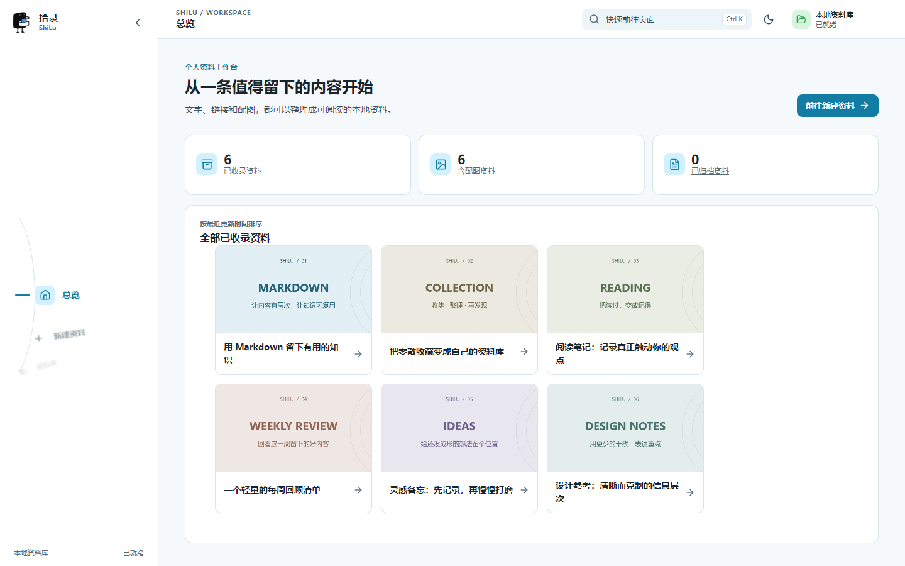
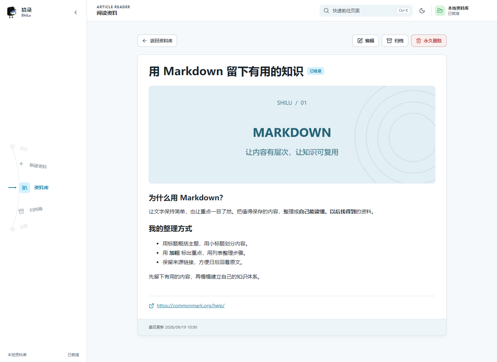
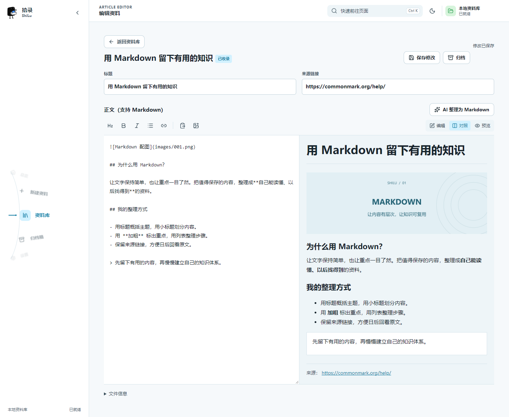

<p align="center">
  
</p>

<h1 align="center">拾录 · ShiLu</h1>

<p align="center">把值得留下的文字、链接和配图，整理成自己的本地 Markdown 资料库。</p>

<p align="center">Windows 桌面应用 · 本地文件存储 · Markdown 编辑与阅读 · 可选 AI 整理</p>

---

刷到一篇好文章、一个实用工具，或一段值得收藏的内容，先收藏起来，却常常在需要时找不到。

**拾录**是一款面向 Windows 的个人资料收集与整理软件。把内容复制过来，填写标题、正文和来源链接，配上图片，就能保存为独立的 Markdown 资料。以后可以在软件里搜索和阅读，也可以直接打开本地文件，交给其他编辑器或 AI 工具使用。

## 界面预览

以下截图来自当前版本的前端界面，使用演示资料和模拟桌面接口，不包含个人收藏或真实密钥。

### 总览：用卡片回看全部资料

显示全部已收录资料，卡片展示正文首图与标题，并按最近更新时间排序。



### 阅读：先看文章，想修改再编辑

标题、配图、正文和文末来源链接集中展示，日常阅读不会露出内部元数据。



### 编辑：Markdown 原文与渲染预览

支持编辑、对照和预览模式，提供标题、粗体、斜体、列表和链接等工具。



## 可以做什么

| 功能 | 说明 |
| --- | --- |
| 收集资料 | 填写标题、正文和可选的来源链接，不限定内容来自哪个平台 |
| 正文配图 | 支持粘贴截图、选择图片；新建页也支持拖拽导入，不必先把截图手动另存为文件 |
| Markdown 编辑 | 编辑原文、查看排版效果，支持标题、加粗、列表、链接等常用语法 |
| AI 辅助整理 | 配置兼容接口后调用模型整理正文，检查结果并主动采纳后才替换原文 |
| 查找与阅读 | 搜索标题、正文或链接；点击资料后默认进入阅读页 |
| 归档与删除 | 不常用的内容可以归档、恢复；错误资料可以永久删除 |
| 自定义资料库 | 自选保存位置，更换目录时支持自动迁移旧资料 |
| 桌面体验 | 弧形滚轮导航、浅色/深色主题、关闭到托盘、单实例运行，以及窗口状态记忆 |

不配置 AI 也可以收集、编辑、保存、搜索和阅读。当前使用文字收集流程，不需要经过 OCR 步骤。

## 安装与开始使用

适用于 **Windows 10 / 11，64 位**。

可前往仓库的 [Releases 页面](https://github.com/ReappealXy/ShiLu/releases) 查看是否已提供安装包。若已有发布，下载对应的 `拾录 ShiLu_*_x64-setup.exe` 并安装；尚无安装包时，可按下方说明从源码构建。

1. 打开软件，在「设置」中选择一个用于保存资料的文件夹，例如 `D:\ShiLuLibrary`。
2. 进入「新建资料」，填写标题、粘贴正文，按需补充来源链接。
3. 在正文上方的配图区粘贴或选择图片，也可以直接拖入图片。
4. 用 Markdown 工具调整排版，或配置模型后尝试 AI 整理；查看结果后决定是否采纳。
5. 点击「保存资料」，新建成功后回到总览，通过卡片打开文章。

资料库列表提供归档和永久删除入口。**永久删除会同时删除对应的本地 Markdown、图片及资料文件夹，无法在软件中恢复。**

关闭窗口会将软件收进系统托盘；需要完全关闭时，请从托盘菜单选择「退出」。

## 配置 AI（可选）

在「设置」中的「Markdown 整理模型」填写：

- **API 地址**：服务商提供的 OpenAI 兼容接口地址。
- **API Key**：该服务商的访问密钥。
- **模型**：点击「获取模型列表」后选择，或手动填写服务商提供的模型名称。

启用模型后，可以点击「测试模型」检查当前配置，再保存设置。获取模型列表不要求预先填写模型名称，测试则针对当前选中的模型。

整理时会把正文发送给你配置的模型服务，可能产生该服务商的调用费用。当前 API Key 保存在本机配置中，未加密；请勿把个人配置文件一起上传到公开仓库。AI 输出仍需检查，具体排版和表达效果取决于所选模型。

## 资料保存在什么地方

拾录以本地文件作为资料来源，**不依赖 SQL 数据库**。每条资料有独立目录，图片使用相对路径关联：

```text
你选择的资料库/
└── articles/
    ├── 20260919-100000-markdown-guide-a1b2c3/
    │   ├── index.md
    │   └── images/
    │       ├── 001.png
    │       └── 002.jpg
    └── 20260919-103000-reading-notes-d4e5f6/
        ├── index.md
        └── images/
```

上面展示的是文章与配图的核心结构，资料库内还会包含配置和索引等辅助文件。`index.md` 保存文章及必要的管理元数据；软件阅读页只展示文章内容。图片引用如 ``，备份或迁移时保留整条资料文件夹即可。

归档只改变资料状态，不删除文件。总览与设置页的已收录数量仅统计正式资料，已归档内容在归档箱查看。

## 从源码运行

普通使用者安装 EXE 即可；只有开发或自行打包时才需要下面的工具。

### 环境准备

- Windows 10 / 11 x64。
- Node.js 22 LTS 与 npm。
- Rust 稳定版，使用 Windows MSVC 工具链。
- Visual Studio 2022 Build Tools：安装「使用 C++ 的桌面开发」工作负载及 Windows SDK，无需安装完整 Visual Studio IDE。
- Microsoft Edge WebView2 Runtime：应用运行所需的桌面 Web 渲染环境。

可参考 [Tauri Windows 环境配置](https://v2.tauri.app/start/prerequisites/#windows) 安装依赖。

### 开发运行

```powershell
git clone https://github.com/ReappealXy/ShiLu.git
cd ShiLu
npm ci
npm run tauri:dev
```

`npm run tauri:dev` 会同时启动前端与桌面应用。`npm run dev` 仅启动前端页面，浏览器中不具备完整的本地文件、剪贴板和托盘能力。

### 构建 Windows 安装包

```powershell
npm run tauri:build
```

NSIS 安装包生成在：

```text
src-tauri/target/release/bundle/nsis/
```

### 代码检查

```powershell
npm run build
cargo fmt --manifest-path src-tauri/Cargo.toml -- --check
cargo test --manifest-path src-tauri/Cargo.toml --lib
```

部分历史 OCR 测试需要额外的 Windows 测试夹具，默认跳过。

## 技术栈与目录

前端使用 **Vue 3 + TypeScript + Vite**，桌面与文件管理使用 **Tauri 2 + Rust**，Markdown 渲染使用 **markdown-it + DOMPurify**，安装包使用 **NSIS**。

```text
ShiLu/
├── src/                  # 页面、组件、样式与桌面接口调用
├── src-tauri/            # Rust 后端、窗口、托盘及打包配置
├── public/               # 应用静态资源
├── docs/                 # 产品与开发文档、README 截图
└── scripts/              # 辅助构建与验收脚本
```

进一步了解：[产品说明](docs/PRODUCT.md) · [架构说明](docs/ARCHITECTURE.md) · [实施记录](docs/IMPLEMENTATION_LOG.md)。开发文档包含早期设计与演进记录，当前使用流程以实际版本和本 README 为准。

## 当前边界与反馈

目前专注 Windows 上的个人本地资料管理，尚未提供 Telegram 自动同步、多平台内容发布、云同步或多人协作。

遇到问题或有改进建议，欢迎提交 [Issue](https://github.com/ReappealXy/ShiLu/issues)。描述操作步骤、预期结果和实际表现，并附上不含私人信息的截图，会更容易定位问题。
