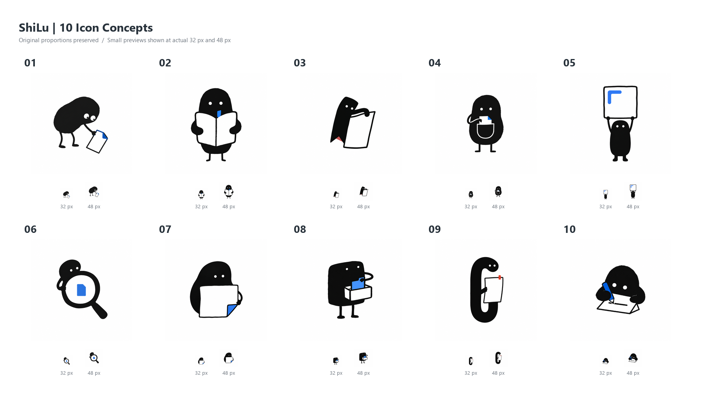

# ShiLu 图标候选

本轮交付 10 张独立候选原图，供用户选型。尚未替换应用、托盘、快捷方式或安装包图标。

## 生成信息

- 服务：用户指定的 Rayin API，`https://www.rayinai.com/v1`。
- 模型：`gpt-image-2`；质量：`medium`；尺寸：每张 `1024 × 1024`；格式：PNG。
- 路径：通过 imagegen skill 自带 CLI 调用指定 API，每个构图单独生成。
- 风格：采用 `ian-xiaohei-illustrations` 的小黑主体、黑白手绘、少量蓝/红点缀、单一核心动作。
- 图标适配：将正文插图的横版改为正方形，去掉文字标注，减少细节。
- 原始提示词：[prompts.jsonl](prompts.jsonl)。API 密钥未写入项目文件。
- 当前为白底候选，不是透明背景成品，也尚未制作 Windows `.ico` 文件。

## 候选对照



| 编号 | 原图 | 含义 |
| --- | --- | --- |
| 01 | [拾起一页](01-page-picker.png) | 把看到的有用内容拾起来保存。 |
| 02 | [抱住知识](02-book-keeper.png) | 收藏后继续阅读与整理。 |
| 03 | [活页书签](03-living-bookmark.png) | 为值得保留的资料做标记。 |
| 04 | [口袋收藏](04-pocket-archive.png) | 把资料装进自己的收藏口袋。 |
| 05 | [截图搬运](05-screenshot-carrier.png) | 将截图带入个人资料库。 |
| 06 | [资料查找](06-search-lens.png) | 从归档内容中重新找到资料。 |
| 07 | [折角笔记](07-folded-note.png) | 把内容整理成可回看的记录。 |
| 08 | [归档抽屉](08-archive-drawer.png) | 将散落的信息有序收好。 |
| 09 | [夹住灵感](09-paperclip-worker.png) | 用纸夹形象表达收集与留存。 |
| 10 | [动笔记录](10-writing-shadow.png) | 将收集的素材转化成自己的文字。 |

## 检查结果

- 10 张原图均可读取，编号完整且唯一，全部为 `1024 × 1024`。
- 已检查总览图的编号、布局、主体完整性，以及 32/48 像素缩略效果。
- 对照图尺寸为 `1792 × 1016`，每张图下方附真实 32/48 像素缩略图；查看器缩放会改变屏幕上的实际显示大小。
- 主观推荐：02 的阅读含义直观，06 的小尺寸轮廓清楚，08 更突出归档属性。
- 小尺寸下动作细节会减少，16 像素托盘场景尤其明显。选定后需再确认是否简化轮廓，并单独验收；当前不视为安装版图标验收通过。

重新生成对照图（不调用生图 API、不修改原图，需 Python 和 Pillow）：

```powershell
python scripts/build-icon-contact-sheet.py --input-dir assets/shilu-icon-concepts --output assets/shilu-icon-concepts/contact-sheet.png
```

## Git 提交建议

Summary: `design: 添加 ShiLu 的 10 款小黑风格图标候选`

Description: `新增 10 张图标原图、编号对照图、32/48 像素预览、生成提示词和选型说明；保留现有应用图标，等待选型确认。`

大白话：先把 10 个样子画好并缩小检查，让用户挑一个，再决定正式图标怎么落地。
